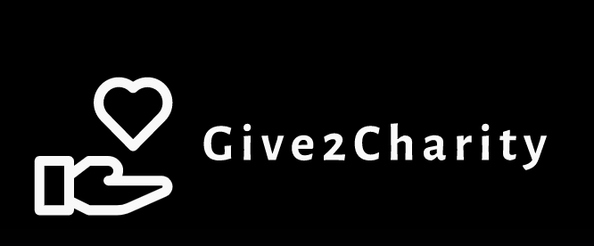

# Give2Charity - A big step to end poverty

Give2Charity is a fully functional web application that has the feature to accept donations from users. This can be money that can be donated or even food, clothes and other essentials.



## 💡 Inspiration

<p>Wastage of food in restaurants , homes , parties and marriages is a big problem in the world and this is prevalent to a large extent in India as well.
Without our knowledge, <b>lot of food is wasted in our home whereas the population of India below the poverty line do not get even one square meal a day!</b></p>
In a country of 1.6 billion people. 6% of the population in India is rich, 45% of the population is in the middle class and a <b>staggering 59% of the population is below the poverty line.</b>
Starvation is one of the major problems in India and along with that the poor population of India don't have access to basic essentials like clothes and footwear and the Coronavirus Pandemic coupled with the rising job losses has pushed people out towards the brink of poverty and bankruptcy.<br><br>

Give2Charity bids an effort to bring forth a solution to this problem and reach out to as many poor, malnourished and unemployed inhabitants of India by providing a complete, full fledged and easy to use platform with round the clock support that can be used by anyone in the world to donate money, food, clothes and all other essentials and contribute to the noble cause we are tackling in this project.

## 📍Salient Features of Our Application<br>
- User friendly homepage with a simple and holistic UI
- Easy one page navigation and to the point content
- A smart AI Powered Chatbot to help the user with any queries they have with immediate assistance.
- Feature for donors to earn rewards and points once they have donated a certain amount.
- Feature to upload images of the clothes and other essentials that they would like to donate.
- A blog to read about the various drives that Give2Charity is carrying out across India.
- Smooth payment gateway interface supporting all Credit Cards, UPI, Google Pay and Paytm.

## 👩‍💻The Technology Stack
### ✅ Web Development:
#### 📍 Wireframing : 
- Balsamiq Mockups

#### 📍 Frontend Development Stack : 
- HTML5 and CSS3 for giving structure and styling to the page. 
- BulmaCSS was also used to style the page. 
- JavaScript was used for the carousel, loading functionality and fixed headers.

#### 📍 Backend Development Stack : 
- Complete backend runtime powered by NodeJS V8 engine.
- ExpressJS and EJS Template Engine to render HTML dynamic pages from the backend.
- For the blog, signup and login page, volunteer registration page and image upload feature, MongoDB is used as the database.
- For signup and login authentication, PassportJS package is used.
- For sending emails to user on signup and login, Nodemailer package is used.

#### 💰 Payment Gateway Interface
- Stripe API with Web Integration to accept payments through credit cards, Paytm, Google Pay, PhonePe and UPI.

### ✅ Machine Learning
- DialogFlow was used to develop the intents for the smart AI powered Chatbot with a custom model to train the agent.
- Deployed and powered by Google Cloud Platform(GCP)
- Telegram integration with Telegram API and BotFather interface.
- To display the bot on the main page of the website: HTML was used for the structure, CSS for the styling and JavaScript was used for the pop up functionality and welcome sound. 

## Demo
[https://www.youtube.com/watch?v=0vE0VPTDcek](Demo Video)
## Run Locally

Clone the project

```bash
  git clone https://github.com/vedanthv/Give2Charity
```

Go to the project directory

```bash
  cd Give2Charity
```

Install dependencies given in requirements.txt

```bash
  npm install
```

Start the server

```bash
  nodemoon app.js
```

## Environment Variables

To run this project, you will need to add the following environment variables to your .env file to use **Stripe Payment Integration**

`API_KEY`

`SECRET_API_KEY`

### 📍Upcoming Features in the Pipeline:<br><br>
⏩ Integration with CRED and Paytm to give rewards to the donors.<br><br>
⏩ Improving the chatbot to add more features and intents<br><br>
⏩ Implementing Dunzo API to help solve the supply chain issue of delivering the essentials from the donor location to the warehouse for distribution.<br><br>
⏩ Make a Flutter Application for Play Store and App Store.<br><br>
⏩ Migrating from MongoDB to Firebase cloud.<br><br>
⏩ Data Analysis and dashboarding statistics for the poverty in India.<br><br>

## Team

- [Tanya Arora](https://www.linkedin.com/in/tanya-arora-916baa202/)
- [Vedanth V Baliga](https://www.linkedin.com/in/vedanthbaliga/)
- [Vishnu Kumar](https://www.linkedin.com/in/vishnu-kumar-98b33a205/)


## Contributing

Contributions are always welcome!

See `contributing.md` for ways to get started.

Please adhere to this project's `code of conduct`.

  

